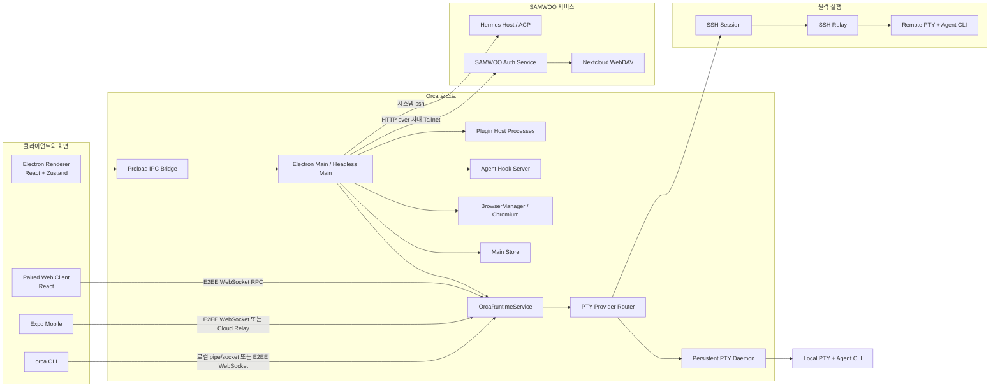

# SAMWOO-ORCA 시스템 아키텍처

> 기준: 2026-08-16, Git commit `706256780`, `package.json` 버전 `1.4.203`
>
> 이 문서는 기능 소개가 아니라 현재 소스 코드의 실행 경로, 상태 소유권, 신뢰 경계와 장애 지점을 기록한다. 배포본이 다른 commit으로 빌드되었다면 해당 배포본을 별도로 대조해야 한다.

## 1. 한 문장 정의

SAMWOO-ORCA는 **여러 AI CLI 에이전트를 로컬·WSL·SSH·원격 Runtime의 작업공간과 PTY에서 실행하고, Electron 데스크톱·웹·모바일·CLI가 하나의 Runtime 상태를 조작하도록 만든 오케스트레이션 시스템**이며, 여기에 SAMWOO 로그인·사내 메일·워크스페이스 공유·Hermes Team Chat이 추가된 구조다.

가장 중요한 사실은 다음과 같다.

- React 화면이 프로세스, 파일, Git 또는 SSH를 직접 소유하지 않는다. Electron main과 그 아래 provider가 권한 작업을 소유한다.
- AI 모델은 Orca 내부 라이브러리로 실행되는 것이 아니라 대체로 PTY 안의 외부 CLI 프로세스다.
- 화면 상태, 영속 설정, Runtime 공개 상태, 터미널 프로세스와 스크롤백은 서로 다른 계층이 소유한다.
- SSH 실행용 relay와 모바일·웹 연결용 cloud relay는 이름만 비슷한 별도 시스템이다.
- SAMWOO 인증 서버와 Nextcloud는 이 저장소 밖에 배포되는 운영 의존성이다. 저장소에는 전체 인증 서버가 아니라 확장 모듈과 설치 코드만 있다.
- Hermes의 로컬 파일/문서/명령 도구는 범용 Orca 파일 API와 별도이며, Excel 작업에서 보고된 오류는 binary 문서를 UTF-8 파일 경로로 보낸 데서 발생했다.

## 2. 전체 시스템 그림



이 그림에서 `Main`, `Runtime`, `Store`, `PTY daemon`, `SSH relay`는 서로 대체 가능한 같은 계층이 아니다. 각자 권한과 수명이 다르므로 기능을 추가할 때 올바른 소유자에게 연결해야 한다.

## 3. 배포 단위와 프로세스 경계

| 단위                       | 주 실행 위치                                       | 책임                                                                 | 수명/주의                                                                                                                  |
| -------------------------- | -------------------------------------------------- | -------------------------------------------------------------------- | -------------------------------------------------------------------------------------------------------------------------- |
| Electron main              | 사용자 PC                                          | 조합 루트, IPC, Store, Runtime, SSH, 브라우저, 업데이트, 통합 서비스 | 앱 수명과 연결되지만 PTY daemon은 정상 종료 후에도 남을 수 있음                                                            |
| Electron renderer          | 사용자 PC의 sandboxed Chromium                     | React UI, Zustand 상태, 사용자 입력, 터미널 렌더링                   | 권한 작업은 preload IPC를 통해 요청                                                                                        |
| Dashboard pop-out renderer | 별도 BrowserWindow/DOM/Zustand                     | agent dashboard 표시                                                 | 격리 partition을 쓰지만 main window와 같은 전체 preload API를 공유                                                         |
| Preload                    | Electron 격리 경계                                 | 허용된 typed API를 `window.api`로 노출                               | renderer에 Node 전체 권한을 주지 않음                                                                                      |
| Orca Runtime RPC           | Electron main 또는 `orca serve`                    | 상태 그래프와 원격 조작 API의 권한 경계                              | 로컬 socket/pipe와 WebSocket/relay를 동시에 제공 가능                                                                      |
| PTY daemon                 | 사용자 PC의 별도 Node 프로세스                     | 로컬 셸 프로세스, 터미널 모델, 이력과 재연결                         | 정상 앱 종료 시 연결만 끊고 셸을 유지하는 것이 기본                                                                        |
| SSH relay                  | SSH 대상 호스트                                    | 원격 PTY, 파일, Git, hook, 포트, 자동화                              | SSH 사용자 권한으로 업로드·실행되며 재연결 가능한 daemon 모드가 있음                                                       |
| Agent CLI                  | 로컬 또는 원격 PTY                                 | Codex, Claude Code, OpenCode 등 실제 모델 상호작용                   | Orca가 모델을 내장 실행하는 것이 아님                                                                                      |
| Plugin host                | 사용자 PC의 별도 Node child process                | 제3자 플러그인 JavaScript 실행                                       | Electron 권한 없이 capability bridge를 사용하지만 OS sandbox는 아님                                                        |
| Hermes document worker     | 사용자 PC의 main-owned frozen Python child process | XLSX/PPTX/PDF 생성·수정·검증                                         | Windows x64 설치본에 고정 engine과 함께 포함하며 main만 실행·취소·파일 commit 권한을 가짐. SSH/Runtime에서는 실행하지 않음 |
| Web client                 | 브라우저                                           | 데스크톱 renderer를 web preload shim과 함께 재사용                   | Runtime-scope pairing이 필요하며 호스트 상태를 소유하지 않음                                                               |
| Mobile app                 | iOS/Android                                        | 모니터링, 명령, 터미널, 작업공간 조작                                | mobile allowlist 범위의 Runtime RPC만 사용                                                                                 |
| SAMWOO auth service        | 사내 서버                                          | 로그인, 세션, 메일 중계, 공유 카탈로그·메시지                        | 전체 서버 본체는 이 저장소에 없음                                                                                          |
| Hermes host                | 사내 원격 서버                                     | Team Chat 모델 세션과 추론                                           | 로컬 앱이 시스템 `ssh`로 연결                                                                                              |
| Nextcloud                  | 사내/운영 서버                                     | 공유 워크스페이스 파일 저장                                          | Orca 클라이언트가 직접 자격증명을 받지 않음                                                                                |

패키징은 `config/electron-builder.config.cjs`가 담당한다. 제품명은 `SAMWOO-ORCA`, app ID는 `com.samwooax.samwoo-orca`이며 Windows 설치 파일명은 `samwoo-orca-windows-setup.exe`다. 데스크톱 빌드는 Electron 번들뿐 아니라 CLI, SSH relay, web client, bundled skills/plugins와 플랫폼별 native 의존성을 함께 만든다. `docs/`는 패키지에서 제외되므로 이 문서는 저장소 문서이며 설치 프로그램 안에 자동 포함되지 않는다.

## 4. 소스 디렉터리 지도

| 경로                               | 역할                                                          |
| ---------------------------------- | ------------------------------------------------------------- |
| `src/main/index.ts`                | 데스크톱·headless 부팅과 종료를 조립하는 composition root     |
| `src/main/ipc/`                    | renderer에서 main으로 들어오는 권한 요청과 SAMWOO/Hermes 확장 |
| `src/main/runtime/`                | Runtime 상태, RPC server, 원격 클라이언트 API, orchestration  |
| `src/main/runtime/rpc/`            | transport, dispatcher, schema, method registry                |
| `src/main/providers/`              | 로컬·SSH 파일/Git/PTY 구현과 capability routing               |
| `src/main/daemon/`                 | 지속형 로컬 PTY daemon과 client/adapter                       |
| `src/main/agent-hooks/`            | 에이전트 hook 수신·설치·상태 정규화                           |
| `src/main/window/`                 | BrowserWindow 생성과 webview 보안 정책                        |
| `src/preload/`                     | renderer에 노출하는 Electron IPC bridge                       |
| `src/renderer/src/`                | 데스크톱 React UI, Zustand store, xterm, 브라우저·편집기 화면 |
| `src/renderer/src/web/`            | 동일 renderer를 Runtime RPC 기반 웹 앱으로 투영하는 shim      |
| `src/shared/`                      | main/renderer/CLI 간 타입, schema, host·workspace 식별 규칙   |
| `src/cli/`                         | `orca` 명령, 로컬 Runtime 연결, remote environment 연결       |
| `src/relay/`                       | SSH 대상에 배포되는 relay 번들                                |
| `mobile/`                          | Expo Router 기반 모바일 클라이언트                            |
| `server/samwoo-auth/`              | 운영 auth server 옆에 설치되는 메일·공유·메시지 확장          |
| `config/`                          | 빌드, 패키징, lint, 호환성 검사, release 스크립트             |
| `native/`, `resources/`, `skills/` | 플랫폼 helper, 패키지 리소스, 번들 skill                      |

## 5. 식별자와 소유권 모델

### 5.1 서로 혼동하면 안 되는 식별자

| 개념                       | 예시                                                 | 의미                                                           |
| -------------------------- | ---------------------------------------------------- | -------------------------------------------------------------- |
| Orca application profile   | 활성 profile의 data file                             | 앱 설정·세션·브라우저 partition을 분리하는 로컬 프로필         |
| SAMWOO login profile       | `ai_center` 같은 서버 판정 profile                   | 사내 권한·메일·공유 범위를 정하는 업무 프로필                  |
| Execution host ID          | `local`, `ssh:<targetId>`, `runtime:<environmentId>` | 파일·Git·PTY 명령을 어느 호스트에서 실행할지 결정              |
| Workspace scope            | `worktree:<id>`, `folder:<id>`                       | Git worktree와 일반 폴더 workspace를 동일 UI에서 구분          |
| Worktree ID                | repo ID와 path를 결합한 ID                           | repo 내 실제 작업 사본의 identity                              |
| Worktree instance ID       | worktree 점유마다 새로 발급                          | 같은 path/ID가 삭제 후 재사용될 때 이전 lineage와 event를 거부 |
| Pane key                   | tab ID + leaf ID                                     | 화면 pane과 실행 세션을 안정적으로 연결                        |
| PTY ID/incarnation         | provider가 발급                                      | 실제 셸 세션과 재생성 세대를 구분                              |
| SSH generation/incarnation | target session 세대                                  | 끊긴 이전 연결의 늦은 이벤트가 새 연결을 오염시키지 못하게 함  |
| Runtime ID                 | 실행 중 Runtime 인스턴스                             | stale metadata 또는 다른 프로세스의 정리를 방지                |

`src/shared/execution-host.ts`와 `src/shared/workspace-scope.ts`가 핵심 규칙이다. 새로운 기능은 최소한 execution host와 workspace scope를 함께 전달해야 한다. 경로 문자열만 보고 로컬 Git worktree라고 가정하면 folder workspace, SSH, paired runtime 중 하나가 깨진다.

WSL은 별도의 `executionHostId` 종류가 아니라 local partition 안에서 project runtime과 distro로 구분되는 실행 변형이다. Windows 프로젝트는 native Windows 또는 지정된 WSL distro 중 하나로 해석되며, 지정 distro가 사라지면 Windows로 조용히 fallback하지 않고 repair-required로 실패한다. Git, terminal/agent, preflight와 setup이 같은 resolved runtime을 써야 하며 Windows 경로를 직접 조립해서는 안 된다.

### 5.2 상태의 실제 소유자

| 상태                                                       | 정본 또는 주 소유자                                     | 다른 계층의 역할                                                  |
| ---------------------------------------------------------- | ------------------------------------------------------- | ----------------------------------------------------------------- |
| repo, project group, settings, persisted workspace session | main의 `Store` (`src/main/persistence.ts`)              | renderer는 IPC로 읽고 변경                                        |
| 현재 탭, pane layout, 선택, 편집기·브라우저 UI 상태        | renderer Zustand (`src/renderer/src/store/index.ts`)    | 필요한 부분을 Store와 Runtime에 투영                              |
| 원격 클라이언트가 보는 탭·PTY·agent·browser graph          | `OrcaRuntimeService`                                    | renderer graph를 coalescing하여 publish                           |
| 로컬 셸 프로세스와 터미널 이력                             | PTY daemon                                              | renderer xterm은 뷰와 입력기                                      |
| 원격 셸 프로세스와 원격 작업                               | SSH relay/provider                                      | main은 세대와 권한을 검증하고 이벤트를 중계                       |
| 브라우저 페이지 process/WebContents                        | main `BrowserManager`                                   | Zustand는 탭 메타데이터를 보유                                    |
| orchestration run/task/message/delivery                    | 별도 SQLite DB                                          | Runtime RPC가 idempotency와 권한 계약을 적용                      |
| pairing device token/key                                   | main의 제한된 pairing 파일                              | web/mobile은 pairing capability를 보유                            |
| SAMWOO auth token                                          | renderer `localStorage`의 `samwoo.auth`                 | auth server가 실제 만료·profile 권한을 판정                       |
| SAMWOO 공유 메타·댓글·메시지                               | auth service SQLite                                     | 로컬에는 파일 hash/ETag sync manifest만 저장                      |
| Hermes ACP session                                         | main의 in-memory session registry와 원격 Hermes process | renderer는 채팅 화면과 로컬 history를 표시                        |
| SAMWOO 예약 정의·실행 원장                                 | renderer `localStorage`의 `samwoo.schedules.v1`         | App-level 30초 runner가 due 판정·실행 상태를 갱신                 |
| SAMWOO 예약 결과                                           | 등록된 local project의 `SAMWOO-예약결과/<예약 ID>/`     | main IPC가 project authority를 재검증하고 새 Markdown 파일로 저장 |

동일한 정보가 여러 곳에 보여도 모두 정본인 것은 아니다. 예를 들어 renderer 탭 상태는 Runtime graph로 복제되며, 터미널 스크롤백은 renderer session보다 daemon checkpoint가 crash recovery의 권위 있는 원천이다.

## 6. 데스크톱 부팅과 hydration

### 6.1 Main 부팅

`src/main/index.ts`의 큰 흐름은 다음과 같다.

1. Electron ready 전 단계에서 PATH, 단일 인스턴스, profile 경로, 진단/GPU/network 조건을 정리한다.
2. `app.whenReady()` 후 활성 Orca profile을 결정하고 해당 profile의 data file로 `Store`를 만든다.
3. proxy, browser session, telemetry, account, usage/rate limit, agent hook 등 main 서비스들을 조립한다.
4. local/SSH/runtime provider를 연결할 `OrcaRuntimeService`를 만든다.
5. IPC handler, plugin, automation, menu와 Runtime RPC server를 등록한다.
6. 데스크톱 창과 Runtime transport를 시작한다. 데스크톱 WebSocket은 처음에는 loopback에만 bind한다.
7. terminal daemon/hook 등 시작 서비스와 복구 작업을 진행한다.

조립 순서는 의도적이다. Store보다 먼저 영속 상태를 사용하는 서비스가 시작되거나, Runtime보다 먼저 원격 요청이 열리면 초기화 중 요청이 부분 상태를 볼 수 있다.

### 6.2 Renderer hydration

`src/renderer/src/App.tsx`는 한 번에 모든 상태를 열지 않는다.

1. profile과 settings를 먼저 읽는다.
2. terminal appearance, keybinding, onboarding, persisted UI를 복원한다.
3. local repo catalog와 host별 workspace session을 읽는다.
4. worktree, 탭, editor, browser 상태를 hydrate한다.
5. SSH 재연결과 terminal provider capability를 확인한다.
6. 기존 terminal과 legacy worker를 복구한 후 `workspaceSessionReady`를 연다.
7. `src/renderer/src/runtime/sync-runtime-graph.ts`가 live Zustand 상태를 Runtime graph와 모바일 snapshot으로 coalesce해 publish한다.
8. remote catalog와 비용이 큰 후속 조회는 첫 화면 뒤로 미룬다.

Hydration 실패 시 `hydrationSucceeded`를 false로 유지해 빈 renderer 상태가 정상 저장본을 덮지 못하게 한다. 다만 UI가 영원히 멈추지 않도록 shell mount를 위한 readiness는 별도로 해제한다. 이 안전장치를 건너뛰는 session write는 복구 가능한 장애를 데이터 손실로 바꿀 수 있다.

### 6.3 Main Store 내구성

`src/main/persistence.ts`는 profile별 state를 debounce하여 임시 파일 작성, flush/fsync, rename과 backup 순으로 저장하며 generation fence와 content hash로 stale/no-op write를 막는다. Store 생성 시 data path를 고정하므로 profile 전환 중 늦게 끝난 비동기 write가 다른 profile 파일에 들어가지 않는다.

Renderer의 관련 상태 변경은 현재 약 150 ms로 session patch를 합치고, main Store는 디스크 쓰기를 약 1초 단위로 합치되 5초 안에는 기록하도록 제한한다. primary JSON 손상 시 복구할 수 있도록 시간 단위 backup ring도 유지한다. active view, GitHub cache, terminal scrollback/history, pairing key와 orchestration DB는 main Store JSON과 별도 sidecar이므로 profile 폴더 하나만 보고 전체 상태를 판단하면 안 된다.

Electron `safeStorage`를 사용할 수 있는 secret은 암호화하지만, 암호화가 불가능하거나 실패하면 현재 구현은 값을 그대로 저장하는 fallback이 있다. 따라서 “Store에 들어가면 항상 암호화된다”는 가정은 맞지 않는다.

## 7. Runtime RPC와 클라이언트 연결

### 7.1 Runtime의 역할

`src/main/runtime/orca-runtime.ts`는 다음을 한 API surface로 묶는 host-side authority다.

- repo/worktree/folder workspace lifecycle
- terminal 생성·입력·resize·snapshot·orphan 복구
- agent session과 상태
- 파일, Git, 브라우저, 포트, SSH
- orchestration run/task/worker
- account, integration, automation, plugin, skill
- mobile/web용 live graph와 event stream

Renderer graph는 아무 창이나 publish할 수 없다. Runtime이 현재 `authoritativeWindowId`를 정하고 그 창의 publication epoch/version을 검증한다. Headless에서는 sentinel window ID로 empty graph를 유지하며 실제 창이 attach되면 PTY binding을 버리지 않고 graph publication 권한만 승계한다. Local PTY provider도 Runtime 생성 시 고정하지 않고 늦게 조회하므로 daemon 재시작 후 새 adapter로 교체할 수 있다.

`src/main/runtime/runtime-rpc.ts`와 `src/main/runtime/rpc/methods/`가 요청을 schema로 검증하고, 연결의 device scope·client identity·capability를 method context로 넘긴다. orchestration mutation은 receipt와 idempotency를 별도로 보장한다.

### 7.2 Transport

| Transport                        | 사용처                           | 현재 경계                                                                  |
| -------------------------------- | -------------------------------- | -------------------------------------------------------------------------- |
| Unix socket / Windows named pipe | 같은 PC의 `orca` CLI             | runtime metadata의 endpoint·token으로 인증, Unix에서는 제한 권한 파일 사용 |
| WebSocket                        | 모바일, web, remote CLI/runtime  | device token과 NaCl 기반 E2EE, heartbeat와 pre-auth 제한 적용              |
| Cloud relay transport            | 직접 연결이 어려운 paired mobile | broker를 거쳐도 application E2EE 유지                                      |

Cloud relay metadata가 있어도 broker가 최종 권한은 아니다. host의 device token, relay device identity와 E2EE handshake가 다시 일치해야 같은 Runtime method에 도달한다. E2EE channel은 hello, auth, ready 단계로 전이하며 relay 연결은 context-bound handshake를 요구한다.

로컬 transport와 WebSocket transport는 현재 프레임/요청 크기를 제한하고 연결 해제 시 in-flight 요청과 connection-scoped state를 정리한다. 로컬 metadata 삭제도 PID와 Runtime ID 소유권이 일치할 때만 수행한다.

패키지 기본 WebSocket 포트는 `6768`, 개발 모드는 설치본과 충돌하지 않도록 `6769`를 사용한다. 일반 데스크톱은 `127.0.0.1`에서 시작하고 사용자가 외부 pairing을 명시적으로 만들 때만 `0.0.0.0`으로 넓힌다. `orca serve`는 원격 제공을 명시한 모드이므로 별도 bind 정책을 가진다.

Pairing link는 단순 주소가 아니라 bearer capability다. web client용 pairing 정보는 URL query가 아니라 fragment에 넣어 proxy log와 `Referer` 노출을 줄인다. 기기는 개별 revoke 가능한 token과 `mobile` 또는 `runtime` scope를 가진다.

- `mobile` scope는 method allowlist를 적용하지만 읽기 전용이 아니다. 허용된 terminal·workspace 변경 작업이 존재한다.
- `runtime` scope는 전체 web client와 원격 CLI가 필요로 하는 더 넓은 API다.
- 예전 scope 없는 device record는 호환성을 위해 mobile로 취급된다.

### 7.3 CLI, Web, Mobile

- `src/cli/index.ts`는 명령을 parse한 뒤 필요할 때만 Runtime client를 만든다. 로컬은 metadata와 pipe/socket을, remote environment는 E2EE WebSocket pairing을 사용한다.
- `src/renderer/src/web/main.tsx`는 데스크톱 React 앱을 재사용하되 Electron preload 대신 Runtime RPC 기반 web shim을 설치한다. full web app은 runtime-scope link를 요구한다.
- `mobile/`은 Expo Router 앱이며 paired host 목록을 모바일 로컬 저장소에 보관한다. PTY process는 소유하지 않고 xterm 계열 WebView로 host terminal을 그린다.
- desktop/mobile protocol 상수는 서로 다른 빌드 경계에 중복되어 있으므로 breaking change 시 양쪽 compatibility를 함께 갱신해야 한다.

Mobile은 direct/Tailscale/relay connection을 stable logical client 하나로 감싼다. 경로를 바꿀 때 새 연결을 먼저 인증하고 subscription을 붙인 뒤 generation을 전환해 이전 socket callback을 버린다. Session snapshot은 publication epoch와 version을 가지며 stream replay만으로 liveness를 단정하지 않고 foreground/periodic list reconciliation을 병행한다. Terminal output은 encrypted binary stream과 gap/resync/ack frame으로 전달되고, active mobile input/viewport lease의 중재자는 client가 아니라 Runtime이다.

Web client는 pairing fragment를 읽은 뒤 주소 표시줄에서 credential을 지우고, host-live tab/PTY topology는 browser storage session에서 제거한다. 재연결 가능한 navigation/history와 Runtime이 소유하는 live graph가 서로 정본 경쟁을 하지 않게 하기 위한 처리다.

## 8. 터미널과 AI 에이전트 실행

### 8.1 로컬 PTY

```text
사용자/Agent launch
  -> Renderer가 tab/leaf와 paneKey 생성
  -> preload IPC 또는 Runtime RPC
  -> main PTY router가 execution host 판정
  -> DaemonPtyAdapter
  -> persistent PTY daemon
  -> node-pty shell
  -> shell 안에서 agent CLI 실행
  -> daemon output/checkpoint
  -> main backpressure 경계
  -> renderer xterm 또는 remote client
```

`src/main/providers/pty-provider-contract.ts`가 공통 계약이고 `src/main/ipc/pty.ts`가 desktop renderer 경계를 감사한다. 로컬 daemon을 사용할 수 없을 때의 fallback provider도 있지만, 정상 경로는 daemon이 process와 history를 소유한다.

앱의 정상 종료는 daemon을 죽이지 않고 disconnect한다. 따라서 Orca 창을 닫았다고 agent 또는 셸이 반드시 끝난 것은 아니다. 반대로 daemon 자체가 죽으면 화면 history는 checkpoint/output log로 복원할 수 있어도 원래 OS process 생존까지 항상 보장하는 것은 아니다.

Daemon 교체 중 기존 session을 모두 새 adapter로 억지 이동하지 않는다. `DaemonPtyRouter`가 session별 기존 adapter 소유권을 유지하고 새 spawn만 current adapter로 보내며, degraded provider는 접근 가능한 daemon session을 보존하면서 새 spawn만 in-process fallback으로 돌릴 수 있다.

### 8.2 SSH PTY

SSH workspace에서는 main이 `SshPtyProvider`를 선택하고 SSH relay가 원격 PTY를 소유한다. PTY ID에 target identity가 반영되고, target generation/incarnation과 source acknowledgement가 stale output·중복 output·이전 연결의 exit event를 차단한다.

원격 terminal의 resize, output backpressure, reconnect, cold snapshot은 로컬 PTY와 같은 UI 계약으로 보이지만 구현 주체는 다르다. 로컬 daemon 전용 가정을 SSH 코드에 재사용하면 안 된다.

### 8.3 에이전트 launch와 상태

`src/renderer/src/lib/launch-agent-in-new-tab.ts`는 agent 설정, argv/env, OS별 quoting, host와 cwd를 정한 뒤 pane을 만들고 시작 명령을 queue한다. 초기 prompt는 agent 종류에 따라 argv 또는 TUI 준비 후 bracketed paste로 전달한다.

CLI/mobile/headless의 agent-session 생성은 renderer가 아니라 execution host Runtime이 소유한다. Operation ID와 request fingerprint를 client별 replay ledger에 남겨 같은 요청은 재생하고 다른 payload 재사용은 충돌로 거부하며, PTY commit 뒤 결과가 불명확해도 tombstone을 남겨 재시도가 agent를 두 번 띄우지 않게 한다. Background 생성은 tab/leaf/pane/handle과 launch token을 먼저 정하고 PTY binding을 commit한 뒤 graph에 publish한다. 그 뒤 renderer reveal이 timeout되어도 이는 표시 실패이지 spawn 실패 증거가 아니다.

Agent status는 process 자체가 아니라 hook event의 정규화 결과다.

1. main hook server가 loopback random port와 매 시작 token을 만든다.
2. 지원 agent의 managed hook/config를 설치하고 PTY env에 endpoint와 token을 주입한다.
3. hook server가 working, waiting, blocked, done, subagent, provider session, transcript path를 pane identity와 함께 받는다.
4. renderer, Runtime graph, notification, keep-awake, usage/stats와 orchestration에 투영한다.
5. SSH relay도 같은 shared hook 형식을 사용해 main으로 전달한다.

Hook가 `done`이라고 표시하는 것과 PTY process가 종료되는 것은 다른 사건이다. `paneKey`, launch token, connection generation 검증을 제거하면 이전 agent의 늦은 hook가 새 pane 상태를 덮을 수 있다.

Hook listener는 localhost token, request/body limit와 schema 검증을 적용하지만 malformed event나 handler 오류도 agent를 막지 않도록 204로 종료하는 관측 계층이다. Persisted status와 transcript path는 재시작 연속성용 hint이며 현재 token·pane·connection 증거 없이 resume authority로 승격하지 않는다.

### 8.4 Native chat

Native chat은 별도 모델 실행 엔진이 아니다. Claude/Codex/Grok 계열 CLI가 만든 JSONL transcript를 읽고 watch/tail/cache하여 채팅 UI로 보여주는 projection이다. 실제 입력과 모델 프로세스는 여전히 terminal 경로에 있다. Watcher는 rotation/truncation을 replacement snapshot으로 처리하고 watch가 불안정하면 bounded polling/reconciliation으로 전환한다.

## 9. 작업공간, 파일과 Git

### 9.1 Workspace 종류

- Git repo의 기본 checkout과 각 worktree
- Git이 없어도 동작하는 folder workspace
- local host의 일반 경로와 WSL 변형
- `ssh:<target>`의 remote workspace
- `runtime:<environment>`의 paired Runtime workspace

기능 구현 시 `repo.path`만 사용하거나 `.git` 존재를 전제로 하면 folder workspace와 remote host를 깨뜨린다. Store의 repo/host metadata와 `Worktree.hostId`가 주는 더 구체적인 authority를 우선해야 한다.

Folder repository는 하나의 synthetic root session과 같은 물리 경로를 공유하는 추가 logical session을 가질 수 있다. 추가 session의 생성·삭제는 Git이나 공유 폴더 자체를 변경하지 않으며 root session은 제거할 수 없다. 파일 접근 전에는 logical session suffix를 제거해 실제 folder path를 얻는다.

### 9.2 생성과 제거 lifecycle

Worktree 생성은 base runtime과 branch를 결정하고, tracking ref를 best-effort로 갱신한 뒤 충돌 없는 branch/path, parent lineage와 push target을 검증한다. Git 생성이 끝나면 다시 목록에서 발견한 worktree에 새 instance ID, Orca provenance와 lineage를 저장하고 Runtime에 등록한다. Sparse checkout 실패는 rollback한다. local Git worktree에만 shared-directory link와 `.worktreeinclude`를 적용하며 SSH 생성은 동등한 원격 권한 계약이 없어 이를 건너뛴다.

제거는 path 문자열을 바로 삭제하지 않는다.

1. 현재 Git list에서 canonical target을 다시 찾는다.
2. main/protected/unregistered/root/home/repository/ancestor 경로와 다른 worktree를 포함한 target을 거부한다.
3. Git lock과 dirty state를 확인하고 content가 있을 때 archive hook를 실행한다.
4. watcher removal gate를 잡고 해당 host의 PTY를 중지·검증한다.
5. Git worktree removal을 수행한 뒤에만 metadata, history와 cache를 지운다.
6. 실패하면 watcher를 복원하고, 성공한 target만 snapshot에서 제거한다.

Orphan 삭제도 Orca가 만들었다는 persisted provenance와 `.git` gitdir 관계 또는 동등한 부재 증명을 요구한다. 폴더 배치 형태만으로 Orca 소유라고 판단하지 않는다. 동일 path-derived worktree ID라도 host ID와 현재 instance ID, SSH에서는 provider generation까지 일치해야 한다.

### 9.3 범용 파일 API

Desktop IPC의 로컬 파일 접근은 `src/main/ipc/filesystem-auth.ts`를 통과한다.

- 허용 root는 locally owned repo, local worktree, local folder workspace와 설정된 workspace root에서 계산한다.
- SSH repo path는 로컬 root로 취급하지 않는다.
- picker로 사용자가 명시한 외부 경로는 제한된 cache에 등록한다.
- `realpath`와 가장 가까운 기존 ancestor를 canonicalize해 symlink escape와 아직 생성되지 않은 경로의 traversal을 막는다.
- Windows drive와 path separator를 고려해 descendant를 판정한다.

Runtime 파일 API는 `src/main/runtime/orca-runtime-files.ts`에서 workspace/host authority를 확인한 뒤 local provider 또는 `src/main/providers/ssh-filesystem-provider.ts`로 보낸다. SSH provider는 relay capability, SFTP 가능 여부와 system transfer fallback을 구분한다.

### 9.4 Watcher

로컬과 SSH file watcher는 UI subscription마다 native watcher를 하나씩 만드는 구조가 아니다. 같은 normalized root의 watcher를 refcount로 공유하고, root generation으로 이전 callback을 버리며, bounded pool·batching과 overflow event로 메모리를 제한한다. recursive deletion 동안은 removal fence가 새 watch 설치를 막고 실제 watcher 종료를 기다린다.

Watcher event는 durable log가 아니다. 200-event cap 등의 overflow 또는 terminal failure를 받은 consumer는 반드시 전체 rescan해야 한다. 원격 relay에서 native watcher가 unavailable/degraded여도 다른 파일 RPC는 정상일 수 있으므로 “SSH 연결됨”과 “watch 보장됨”을 같은 상태로 표시하면 안 된다.

### 9.5 Git

Git 작업도 local, WSL, SSH, runtime host별 provider를 통해 실행한다. Git binary와 버전은 호스트마다 다르므로 Git 2.25가 core workflow baseline이다. 새 subcommand/option을 도입할 때는 좁은 unsupported 오류 판정과 host-scoped `GitCapabilityCache`, 구버전 fallback이 필요하다. GitHub 전용 의미를 generic review/Git 계층으로 새어 나오게 해서는 안 된다.

## 10. SSH와 두 종류의 relay

### 10.1 SSH 연결

`src/main/ipc/ssh.ts`는 target별 active session을 관리하고 연결 lifecycle을 직렬화한다. 일반적으로 `ssh2`를 사용하지만 ProxyJump, ProxyCommand, GSSAPI나 플랫폼 조건에서는 system OpenSSH로 전환할 수 있다. system transport가 SFTP를 제공하지 못하면 exec 기반 file transfer가 fallback이다.

SSH 대상에 업로드되는 `src/relay/relay.ts` 번들은 framed JSON-RPC로 다음을 제공한다.

- remote PTY와 terminal history
- file read/write/watch/transfer
- Git과 worktree
- preflight와 port forwarding
- agent hook, plugin, automation, workspace session

Unix 원격에서는 relay가 socket 기반 daemon으로 남고 새 SSH channel이 `--connect`로 붙을 수 있다. version, endpoint credential, frame size, keepalive, chunking과 backpressure가 protocol 일부다.

현재 wire protocol은 13-byte header의 sequence/ack frame을 사용하고, keepalive는 5초·timeout은 20초이며 file stream은 256 KiB chunk와 4-chunk ACK window를 사용한다. control, interactive와 bulk lane을 분리하고 bounded admission을 적용해 큰 Git/file 응답이 terminal 입력을 막거나 memory를 무한히 늘리지 않게 한다. 취소는 `rpc.cancel`로 원격 request까지 전달된다.

Relay는 OS/architecture별 content hash version 아래에 staging·lock·완료 marker를 사용해 배포한다. endpoint credential과 target별 socket/pipe 이름으로 같은 remote account의 다른 target attachment를 구분한다. `node-pty`나 native watcher가 remote glibc/플랫폼 문제로 로드되지 않으면 해당 capability만 degraded될 수 있다.

중요한 신뢰 경계는 “relay에 등록된 workspace root 목록” 자체가 아니다. generic relay FS/Git의 최종 권한은 인증된 SSH account와 endpoint credential, 그리고 desktop 쪽 path/selector 검증의 조합이다. 잘못 권한 부여된 relay client는 remote OS account가 접근 가능한 범위까지 영향을 줄 수 있으므로 SSH account 자체도 최소 권한이어야 한다.

### 10.2 이름이 비슷한 별도 relay

| 구분                | 목적                                              | 연결 방향                                 |
| ------------------- | ------------------------------------------------- | ----------------------------------------- |
| SSH relay           | 원격 개발 호스트에서 PTY/파일/Git 실행            | Desktop main -> SSH host                  |
| Desktop cloud relay | NAT 등으로 직접 접속하기 어려운 mobile/web를 중계 | Mobile/web <-> broker <-> Desktop Runtime |
| WSL hook relay      | WSL 안 agent hook를 Windows host로 전달           | WSL process -> Desktop hook service       |

이 세 경로의 credential, lifecycle, protocol을 하나로 합치면 권한 경계가 무너진다.

## 11. 브라우저, Computer/Design와 포트

### 11.1 Embedded browser

브라우저 탭의 제목·URL·선택 같은 메타데이터는 renderer store에 있지만 실제 page `WebContents`와 CDP 제어는 main의 BrowserManager가 소유한다. 데스크톱은 sandboxed `<webview>`, headless serve는 display가 있을 때 offscreen `WebContents`를 사용한다.

`src/main/window/createMainWindow.ts`의 보안 계약은 다음과 같다.

- main renderer는 preload bridge와 `sandbox: true`를 사용하며, context isolation/Node integration은 현재 Electron의 안전한 기본값에 의존한다.
- `will-attach-webview`에서 URL과 persistent partition을 registry allowlist로 검증한다.
- renderer가 넘긴 preload/preloadURL을 제거하고 close-only preload만 주입한다.
- guest의 Node integration을 끄고 context isolation, sandbox와 고정 preference를 강제한다.

BrowserManager/CDP가 navigation, screenshot, text/input, design mode, screencast, certificate decision과 parking을 처리한다. renderer가 임의 partition이나 preload를 되살리는 변경은 이 신뢰 경계를 우회한다.

정확히는 top-level main window와 dashboard pop-out이 `contextIsolation`과 `nodeIntegration` 값을 코드에 명시하지 않고 현재 Electron 기본값에 의존한다. dashboard pop-out은 isolated partition, navigation policy, permission deny와 `webviewTag: false`를 적용하지만 전체 preload capability를 재사용한다. Electron 기본값 변경이나 새 top-level document 추가 시 이 가정을 명시적으로 재검증해야 한다.

Browser page ownership은 workspace/worktree와 stable page ID로 검증하지만 cookie와 storage 격리는 browser session profile/partition 기준이다. 서로 다른 worktree라도 같은 browser profile을 고르면 의도적으로 cookie를 공유한다. SSH 서비스도 원격 Chromium에서 자동으로 열리는 것이 아니라 loopback SSH forward를 거쳐 로컬 Electron browser에서 열린다.

### 11.2 포트 탐지와 SSH forwarding

Local port scanner는 Linux `/proc`, macOS `lsof`, Windows listener/process metadata를 제한 시간과 결과 cap 안에서 조사한다. 가장 깊은 process cwd와 command-line path boundary로 workspace를 추정하고, terminal에서 발견한 HTTP(S) origin을 보조 신호로 쓴다. 이 attribution과 advertised URL은 힌트이지 권한 증명이 아니다.

Process stop은 caller가 준 PID/port를 그대로 믿지 않고 exact listener를 다시 scan해 현재 workspace 소유를 확인하며 Electron process는 renderer 요청으로 종료하지 않는다.

SSH port scanner는 connection 단위로 동작하고 reconnect 직후 이미 있던 listener를 baseline으로 표시해 전부 자동 forward하지 않는다. Forward는 현재 ssh2 또는 system OpenSSH transport를 사용하며 local listener를 항상 `127.0.0.1`에 bind한다. Forward record와 복구는 connection generation을 확인하고, local port 충돌로 복구가 실패해도 설정을 남겨 다음 reconnect에서 다시 시도한다.

## 12. Account, Orchestration, plugin과 skill

### 12.1 Managed provider account

Codex와 Claude의 account record와 host/WSL별 선택은 main Store에 있고 account service가 mutation을 직렬화한다. 각 managed identity는 app userData 또는 해당 WSL distro 안의 marker-backed 격리 home/auth directory를 사용한다. Renderer에 반환하는 summary에는 raw secret을 넣지 않으며, 외부 config/home path import는 in-process local caller에만 허용한다.

Runtime auth service는 선택한 account를 실제 CLI 실행 home에 materialize하고 provider가 갱신한 credential을 identity·freshness·Orca ownership이 증명될 때만 다시 읽는다. Orca가 들어오기 전 system default를 snapshot하고 현재 파일이 여전히 Orca baseline과 맞을 때만 복원해 사용자가 밖에서 한 login을 덮지 않는다. Claude refresh-token rotation은 해당 credential을 쓰는 live PTY가 있으면 drain까지 미룬다. WSL account는 distro별로 격리하며 사용할 수 없는 distro는 다른 host로 fallback하지 않는다.

Account add/remove 실패 시 marker와 canonical containment가 증명된 managed directory만 rollback/delete한다. Reset-credit 같은 provider mutation은 durable attempt ledger와 idempotency key를 사용해 결과 불명확 상태에서 이중 실행하지 않는다.

### 12.2 Orchestration

`src/main/runtime/orchestration/`은 단순히 여러 terminal을 여는 UI가 아니다. 별도 SQLite에 run, task, dependency, message, question, delivery와 worker dispatch를 저장한다.

Coordinator가 task를 만들고 worker를 dispatch하면 Runtime이 placement를 결정해 기존 folder/worktree를 재사용하거나 새 worktree를 만든 뒤 agent terminal을 시작한다. worker 결과는 hook/transcript/PTY를 통해 관찰되며 `worker_done`, escalation과 blocking question은 durable message로 coordinator에 배달된다. Paired runtime으로 보내는 federation도 capability/version/peer fingerprint를 확인하고 동일한 lifecycle 계약을 사용한다.

Mutation receipt와 contract version은 재시도 중 중복 worker 생성이나 다른 coordinator의 권한 탈취를 막는 핵심 장치다.

### 12.3 Plugin

Plugin service는 discovery, manifest/engine/API 검증, content hash/integrity, consent fingerprint, disable/kill list, contribution registry와 audit log를 소유한다. 제3자 JavaScript는 Electron renderer/main 안이 아니라 `ELECTRON_RUN_AS_NODE`로 실행되는 별도 Node child process에 올라간다.

Plugin host는 OS sandbox가 아니다. Capability bridge는 Orca host API를 제한하지만 plugin worker의 일반 Node filesystem/network 접근 자체를 OS 계정 수준에서 차단하지는 않는다. Panel은 opaque origin, message budget, session owner와 navigation guard를 사용한다. 새 plugin API는 capability chokepoint와 audit를 거치도록 해야 한다.

### 12.4 Skill

Skill은 `SKILL.md` 중심의 instruction package다. 여러 agent/provider 설치 위치와 bundled manifest에서 탐색되며 CLI로 설치·갱신할 수 있다. Discovery는 요청의 execution owner에서 수행하고 canonical realpath와 symlink loop/depth/file-size 제한을 적용한다. Global updater는 canonical global/alias 설치만 쓰며 repo/plugin-owned skill은 덮지 않고, 실행 후 디스크를 다시 scan해 exit code가 아니라 실제 상태를 정본으로 삼는다. Skill 자체는 plugin process와 같은 실행 sandbox가 아니다.

## 13. Headless, Web와 Mobile 운영 모드

`orca serve`는 UI 없는 별도 제품이 아니라 같은 main/Runtime 조립을 headless로 시작하는 경로다.

- local PTY provider와 Runtime RPC를 준비한다.
- orchestration과 legacy worker를 복구한다.
- renderer가 없으므로 명시적인 empty graph를 publish한다.
- display가 있으면 offscreen browser provider를 설치한다.
- automation을 시작하고 ready 정보를 출력한다.
- desktop auto-updater lifecycle은 사용하지 않는다.

Linux headless browser는 Chromium용 display가 필요해 AppImage 운영 시 Xvfb 구성이 필요할 수 있다. 서버가 bind되는 주소, reverse proxy, 방화벽과 pairing credential은 운영자가 명시적으로 관리해야 한다.

## 14. 종료와 복구

종료는 renderer와 main이 협력한다.

1. renderer `beforeunload`가 terminal/session 상태를 동기 checkpoint한다.
2. main `before-quit`는 새 cloud relay 작업, keep-awake와 일부 background 기능을 막지만 terminal cleanup은 아직 하지 않는다.
3. 첫 `will-quit`는 종료를 잠시 막고 plugin host, hooks, WSL relay, browser/emulator, SSH, PTY adapter/watchers, Store/RPC/stats를 deadline 안에 정리한다.
4. telemetry flush 후 두 번째 quit에서 실제 종료한다.
5. 정상 종료에서는 persistent PTY daemon과 연결만 끊어 셸 생존을 허용한다. 개발 parent shutdown 같은 명시 경로는 daemon을 끝낼 수 있다.

Renderer가 두 번째 unload에서 빈 상태를 다시 저장하지 않도록 guard가 있다. Runtime metadata도 현재 PID/Runtime ID가 소유한 파일만 지운다.

종료 barrier는 현재 20초로 제한되어 있어 storage나 transport가 계속 멈추면 최신 상태 내구성보다 process 종료를 우선한다. 반대로 첫 창은 daemon/hook 준비를 무한정 기다리지 않으며, 장시간 실패하면 제한된 in-process local PTY fallback으로 진행할 수 있다. 이 fail-open 경로는 앱 사용 가능성을 높이지만 재시작 생존 보장은 낮아진다.

## 15. SAMWOO 확장 아키텍처

SAMWOO 기능은 Orca core의 한 서비스가 아니라 여러 별도 경로로 추가되어 있다.

### 15.1 로그인과 session

```text
SamwooLoginGate
  -> preload `samwooAuth.login`
  -> main `src/main/ipc/samwoo-auth.ts`
  -> HTTP POST /login
  -> SAMWOO auth service
  -> bearer token + name/role/profile
  -> renderer localStorage `samwoo.auth`
```

- 기본 auth URL은 `http://100.116.18.119:8823`이다.
- main handler는 renderer가 넘긴 optional `authUrl`도 현재 허용한다.
- 비밀번호는 요청 시 서버로 전달되고 클라이언트에 저장하지 않는다.
- token, 로그인 ID, 표시 이름, role, profile label은 renderer localStorage에 남아 재시작 후 gate를 통과한다.
- startup의 local validation은 저장값 형태를 보는 수준이며 실제 만료는 다음 서버 요청에서 드러날 수 있다.

Main 요청 timeout은 30초지만 현재 login handler에는 login/password 길이, response body 크기와 HTTP status/content-type을 먼저 제한하는 별도 gate가 없다. 같은 bearer가 mail, workspace share와 profile message 권한을 함께 가지므로 token 유출의 영향 범위도 로그인 화면 하나에 그치지 않는다.

`server/samwoo-auth/`에는 `/opt/samwoo-auth/auth-server.py`에 설치할 확장과 installer가 있지만 `auth-server.py` 본체는 없다. 따라서 이 저장소 테스트만으로 운영 서버의 base login 구현, TLS/proxy/ACL 설정과 실제 배포 버전까지 검증할 수 없다.

### 15.2 메일

로그인 token은 mail API의 bearer로도 사용된다. `mail_ext.py`는 사용자 메일 secret을 서버 process memory에 기본 8시간 보관한다. `cryptography`가 있으면 process-local Fernet으로 감싸고, 없으면 평문 메모리 fallback을 사용한다. 디스크에는 쓰지 않지만 auth service 재시작 시 메일 secret은 사라져 다시 로그인해야 한다.

Hermes가 메일 API를 호출할 때 앱은 `MAILTOKEN`을 원격 process 환경에 주입한다. token 자체를 모델 prompt/transcript에 직접 넣지 않는 계약을 유지해야 한다.

### 15.3 공유 워크스페이스

```text
로컬 프로젝트
  -> 파일 정책 필터 + local sync manifest
  -> main SAMWOO share client
  -> auth service profile/permission 검사
  -> restricted Nextcloud service account
  -> SAMWOO-Workspaces/<server-profile>/<share-id>/
```

중앙 카탈로그는 login session에서 profile을 서버 측으로 결정하므로 클라이언트가 다른 profile을 지정할 수 없다. 권한은 list only, local copy, can contribute로 나뉘며 owner 권한과 댓글·메시지·board lane 상태도 서버가 관리한다.

파일 동기화의 현재 계약은 다음과 같다.

- local project만 대상으로 하며 SSH/runtime workspace는 먼저 로컬로 복사해야 한다.
- `.git`, `node_modules`, build output, `.ssh`, `.aws`, `.gnupg`, secret `.env`, key·credential 파일과 symlink를 제외한다.
- template/example `.env`는 허용할 수 있다.
- 파일당 16 MiB, workspace당 5,000개 제한이 있다.
- ETag와 local hash를 비교하고 양쪽 변경은 conflict로 남긴다.
- 삭제는 preview 후 사용자가 확인한 항목만 반영한다.
- sync manifest는 app userData의 `samwoo-workspace-sync` 아래에 두고 local path/secret을 중앙 카탈로그에 올리지 않는다.
- auth service는 raw workspace token 대신 SHA-256 hash를 제한 권한 SQLite에 저장해 서비스 재시작 후에도 session을 복원한다.

주의할 차이도 있다. 범용 파일 API는 `resolveAuthorizedPath`를 쓰지만 `src/main/ipc/samwoo-workspace-file-sync.ts`의 handler는 renderer가 준 absolute source/destination을 직접 `path.resolve`한 뒤 동기화한다. remote entry의 root 탈출은 막지만, 선택한 local root 자체가 Store의 허용 workspace인지 같은 main-side 검증을 사용하지 않는다. 현재는 trusted top-level renderer와 picker를 신뢰하는 별도 경계다.

자세한 사용자 동작과 서버 설치는 `docs/samwoo/WORKSPACE-SHARING.md`에 있다.

### 15.4 Hermes Team Chat

Hermes Team Chat은 일반 agent terminal과도, SAMWOO auth server에서 직접 모델을 실행하는 구조와도 다르다.

```text
Renderer HermesTeamChatView
  -> preload Electron IPC
  -> main hermes-team-chat runner
  -> 시스템 ssh
  -> Hermes host의 agent/ACP process
  -> 모델 응답
  -> 필요 시 <orca_local_files> / <orca_local_documents> / <orca_local_commands>
  -> main이 선택한 local project 또는 요청 한정 문서 첨부를 검증한 뒤 실행
  -> 결과를 Hermes 모델에 돌려줌

호환 경로: token-protected local loopback chat server (기본 127.0.0.1:47821)
  -> 같은 main runner
```

- SSH workspace와 paired web runtime에서는 자동 Hermes launch를 막고 local worktree/folder workspace에서만 연다.
- 기본 Hermes host는 `hermes@100.68.242.83`, profile cwd는 `/opt/data/profiles/<profile>` 계열이다.
- 일반 모델은 one-shot stream, Hermes 모델은 JSONL ACP persistent session을 사용하며 idle session을 정리한다.
- local chat HTTP server는 loopback에만 bind하고 app userData의 제한 권한 token file로 요청을 인증한다.
- chat URL query에는 profile, label, host, cwd와 현재 `mailtoken`이 포함된다. 실제 화면은 BrowserPane이 해당 route를 인식해 native React view로 대체한다.
- native file picker는 96KB 이하 UTF-8 텍스트와 64MiB 이하 PDF/XLSX/PPTX/PNG/JPEG를 구분한다. binary는 renderer/Base64에 싣지 않고 Electron main의 private artifact store로 복사·해시한 뒤 opaque ID만 renderer에 반환한다.
- Hermes Team Chat 탭이 활성일 때 project Explorer의 파일 선택은 Native Chat용 `@상대경로` 문자열을 삽입하지 않는다. Renderer는 현재 chat route의 local project root와 Explorer relative path를 main에 보내고, main은 Store 허용 root·canonical containment·regular file을 다시 확인한 뒤 binary는 같은 private artifact store로, 96KB 이하 UTF-8 파일은 text attachment로 admission한다.
- artifact는 conversation에 귀속하고 동시에 하나의 request에만 배타적으로 결합한다. request 종료 시 결합만 해제해 같은 대화의 후속 질문에서 재사용하며, 사용자가 첨부를 제거하거나 대화를 닫을 때, 1시간 TTL 만료 또는 앱 종료 시 실제 파일을 정리한다. 붙여넣은 이미지는 기존 임시 파일·SSH upload 호환 경로를 사용하고 turn 종료 뒤 재사용하지 않는다.

표시 history, model/effort와 conversation ID는 renderer localStorage가 소유하고, main은 in-flight controller와 Hermes ACP process를 소유한다. Conversation당 active request는 하나로 직렬화하며 host/profile/mail token이 바뀌거나 process가 닫히면 session을 교체하고 30분 idle 뒤 정리한다. Loopback server의 send/cancel/close는 chat token을 요구하지만 direct Electron IPC는 trusted preload/renderer 경계를 신뢰한다.

원격 SSH는 로컬에서 shell 없이 argv로 실행하지만 `StrictHostKeyChecking=accept-new`라 첫 연결은 TOFU다. 현재 원격 Claude 실행은 bypass/dangerous permission mode를 사용하고 Hermes ACP permission request는 취소 중이 아니면 허용 option을 자동 선택한다. 따라서 remote profile filesystem, SSH key/known_hosts와 Tailnet ACL도 이 기능의 신뢰 경계다.

#### 로컬 파일 도구

`src/main/ipc/hermes-local-project-files.ts`와 protocol parser의 현재 제한은 다음과 같다.

- 한 요청에 최대 8개 operation
- list/read/write만 허용
- project root 기준 relative path만 허용하고 canonical path를 다시 검증
- `.git` 쓰기 금지
- UTF-8 text만 허용하고 binary/NUL 거부
- 파일당 512 KiB, 한 응답 합계 768 KiB, directory list 500개
- write content는 canonical Base64여야 함
- 기존 파일 변경 시 앞서 read한 SHA-256, 신규 파일 생성 시 `expectedSha256: null` 요구
- temp file + rename과 project별 queue로 write 충돌 방지
- project가 admission된 뒤 각 file write마다 별도 사용자 approval dialog를 띄우지는 않음

#### 로컬 문서 도구

`src/main/ipc/hermes-local-project-documents.ts`는 UTF-8 파일 도구를 완화하지 않고 별도 `<orca_local_documents>` protocol로 PDF/XLSX/PPTX를 처리한다.

- 한 요청에 최대 4개 문서 operation을 허용한다. 읽기·번역 외에 `create_pptx`/`edit_pptx`와 `create_pdf`/`edit_pdf`가 신규 파일만 생성한다.
- project 파일은 기존 canonical root authority를 재사용한다. 직접 첨부는 main artifact store에서 해시를 다시 확인한 뒤 요청 한정 `@attachments/...` virtual path로만 모델에 노출한다.
- 입력·출력은 파일당 64MiB, 결과 합계는 768KiB다. legacy loopback Base64 경로는 호환용으로만 유지하고 96MiB body 상한을 둔다.
- PDF는 최대 1,000페이지, 호출당 10페이지, 페이지당 32,000자까지 text layer를 추출한다. 생성 spec은 페이지별 비어 있지 않은 `text` element와 top-left 기준 inch 좌표·크기·글꼴 크기·행간·굵기·색·정렬만 허용한다. bundled worker는 이 요소를 실제 PDF text object로 그리고 페이지별 텍스트를 재추출해 하나라도 비면 실패한다. 페이지 삭제·재배열·회전·병합, watermark, metadata 편집도 지원하지만 스캔 OCR과 기존 PDF의 임의 본문 치환은 아직 지원하지 않는다.
- XLSX는 OOXML ZIP/XML에서 문자열, 숫자, boolean, 날짜, 오류, 수식 셀을 추출한다. 각 item은 읽기용 `text`, 저장된 정밀 값을 보존하는 `rawValue`, 수식과 number format metadata를 구분해 반환한다. 계산 cache가 비어 있는 수식은 수식 자체와 참조 셀 값을 제공하며 임의의 Excel 계산 engine을 가장하지 않는다. 번역 대상은 문자열 셀로 제한하고 style·formula·chart·media archive entry를 유지한다.
- XLSX 추출은 호출당 200셀, 적용은 128셀이다. 모델이 200보다 큰 양의 `limit`을 요청하면 main parser가 200으로 낮춰 실행하고 `nextCursor`로 페이지네이션한다. 0·음수·비정수는 계속 거부한다. 원문 문자열과 원본 SHA-256이 모두 같아야 하며 원본과 다른 신규 `.xlsx` project path로만 저장한다.
- PPTX는 슬라이드 순서대로 텍스트 문단과 표·차트·이미지 개수를 추출한다. 번역은 추출 문단과 원본 SHA-256 일치를 요구한다. bundled worker는 슬라이드·텍스트·도형·표·차트·이미지 생성과 텍스트 교체, 슬라이드 추가·삭제, 표 셀·요소 편집을 신규 `.pptx`로 저장한다.
- 선택된 local project가 없는 직접 첨부 번역은 Electron main이 native save dialog를 열어 사용자가 목적지를 승인한다. 기존 파일을 덮어쓰지 않는다.
- ZIP은 최대 4,096 entry, entry당 64MiB, 총 비압축 256MiB, XML당 16MiB다. DOCTYPE/ENTITY, archive path 탈출, 매크로·ActiveX·OLE, 외부 OOXML 관계를 거부한다.
- PDF.js와 OOXML 읽기·번역은 30초 timeout·memory limit이 있는 Node worker thread에서 실행한다. PDF.js는 PDF 요청에서만 lazy-load하고, Node용 DOMMatrix/ImageData/Path2D를 제공하는 플랫폼별 `@napi-rs/canvas`와 `pdf.worker.mjs`를 packaged resource 경계에서 확인한다. 일반 생성·편집은 Python 3.13과 고정된 openpyxl/XlsxWriter/python-pptx/pypdf/reportlab을 PyInstaller one-folder 실행파일로 빌드해 Windows 설치본의 `Resources/hermes-excel-artifact-worker`에 포함한다. Electron→Python JSONL은 환경과 host 양쪽에서 UTF-8로 고정하며, main은 사용자 파일명과 분리된 ASCII staging 이름을 생성하고 성공·실패 모두 `finally`에서 제거한다. 사용자의 Python·pip·Office package를 사용하지 않는다.
- project-backed source/output은 local worktree와 folder workspace에서만 동작한다. SSH/Runtime 경로를 로컬 path로 해석하지 않으며, 요청 첨부의 추출만 project root 없이 가능하다.
- Electron main은 worker bundle manifest와 실제 engine metadata를 probe한 경우에만 Excel Artifact v1의 `create`/`modify`/`validate`/`cancel` capability를 trusted instruction에 넣는다. `<orca_excel_artifact>`는 local file/document/command envelope와 하나의 union으로 parse하고, capability가 없거나 SSH/Runtime workspace이면 실행하지 않는다. LibreOffice render/preview capability는 계속 비활성이다.
- 모델에는 `output.overwrite`, 네 개의 validation boolean, preservation policy enum, column/row/autofilter/page setup의 정확한 v1 JSON 형태를 제공한다. v1.4.201은 관측된 안전한 별칭과 누락 기본값만 main에서 정규화하고 충돌하는 canonical/alias 값과 알 수 없는 field는 worker가 계속 거부한다.

#### Excel Artifact job 경계

- 모델은 strict Workbook Spec v1과 workspace-relative output 또는 opaque artifact input만 낸다. main은 `@attachments/...`를 conversation/request-bound artifact ID로 바꾸며 worker에는 root와 hash-bound private path를 trusted context로 별도 전달한다.
- main은 conversation/workspace scope의 idempotency fingerprint를 mutation 전에 append+fsync receipt로 기록한다. 동일 key·동일 요청은 terminal result를 재사용하고, 다른 요청은 `job_conflict`, 종료 상태가 유실된 요청은 `job_result_unknown`으로 자동 재실행을 막는다.
- worker는 private staging에서 생성·수정한 뒤 OOXML, 수식, chart reference와 선언 spec을 재검증하고 같은 volume에 원자적으로 commit한다. project가 없는 직접 첨부 결과는 private workspace commit 후 native save dialog와 create-only copy를 통과해야 receipt가 terminal이 된다.
- main request cancellation은 활성 frozen worker를 종료하며 결과·오류는 private path, argv, 환경, credential을 제거한 구조만 Hermes에 반환한다. worker process와 실제 파일 권한은 서버 Hermes가 아니라 Electron main이 소유한다.

#### 로컬 명령 도구

`src/main/ipc/hermes-local-project-commands.ts`의 현재 제한은 다음과 같다.

- 한 요청에 최대 4개 operation
- `bun`, `node`, `npm`, `npx`, `pnpm`, `py`, `python`, `python3`, `streamlit`, `uv`, `yarn` allowlist
- shell 없이 argv로 spawn
- foreground timeout 1~600초, 기본 120초
- 결과 output tail 최대 64 KiB
- foreground 실행과 background server 실행을 구분
- 사용자 approval dialog를 거쳐 실행
- 실행 파일과 Python package는 사용자 PC의 PATH/환경에 실제로 존재해야 함

모델이 요청할 수 있는 local tool 실행은 한 사용자 요청당 최대 8회다. 이 값은 화면 작업 범위나 Python 코드 줄 수 제한이 아니라 **모델 응답 -> local tool 실행 -> 결과 반환** 반복 횟수다. envelope JSON 파싱이 실패하면 main이 먼저 결정적 교정을 시도한다(`hermes-local-envelope-json-repair.ts`): 닫는 중괄호·대괄호 **정확히 한 개**를 삭제하는 후보 중, 다음 토큰이 구조 문자(`,`/`]`/`}`/끝)라 스칼라 토큰이 접합될 수 없는 위치만 고려하고, 파싱 가능한 후보 결과가 **유일할 때만** 채택한다. 서로 다른 복원 결과가 둘 이상이면 다의적이므로 교정하지 않고, 잘린 JSON을 완성하지 않으며, 문자열·값·필드를 바꾸지 않고, 교정 후에도 기존 schema 검증을 그대로 통과해야 실행된다. 후보 탐색은 64MB 작업 예산으로 제한한다. host가 교정하지 못한 envelope는 아무 operation도 실행하지 않은 채 같은 모델 세션에 최대 두 번 교정 요청하며 이 회차는 실행 한도에 포함하지 않는다. 세 번째 malformed 응답은 `local_tool_protocol_invalid`로 종료한다. 8번째 실행 결과 뒤에는 도구를 실행하지 않는 최종 답변 전용 모델 회차를 한 번 허용한다. 해당 회차가 다시 도구를 요청하면 실행 전에 차단하고, 앞서 실행된 operation의 종류·대상·성공 여부를 실패 응답에 함께 반환한다.

각 실행 결과는 `src/shared/hermes-team-chat-result.ts`의 `toolExecutions`로 최종 성공·실패·취소 응답에 보존된다. renderer는 이를 `hermes-team-chat-tool-execution-summary.ts`로 요약해 표시하므로, 마지막 모델 문장만 보고 이미 수행된 local write·command를 잃어버리지 않는다.

파일·문서·명령 envelope는 답변 전체에 정확히 하나만 있어야 한다. 둘 이상을 같이 출력하거나 태그는 있지만 JSON/schema가 잘못된 응답은 일반 답변으로 통과시키지 않는다. 최대 두 번의 모델 교정 뒤에도 유효하지 않을 때만 `local_tool_protocol_invalid`로 실패시킨다. 명령 요청은 `mode: "foreground" | "background"`와 초 단위 `timeoutSeconds`를 사용하며, `foreground` boolean이나 `timeoutMs`는 유효하지 않다.

Team Chat cancellation controller는 원격 모델/SSH 전송과 요청 ID에 등록된 local document worker를 즉시 종료한다. 이미 시작한 foreground command process는 아직 직접 연결되지 않아 요청 timeout 또는 자체 종료까지 계속될 수 있다.

Background local command는 managed process ID를 반환하고 명시적 stop 또는 자연 종료까지 chat보다 오래 남을 수 있다. 또한 profile 목록 조회 경로는 renderer가 준 profile-list command를 platform shell로 실행하므로 trusted renderer compromise 시 임의 local command surface가 된다. 동일 request ID의 동시 Team Chat 요청은 main in-flight registry가 거부한다.

### 15.5 예약 지시와 결과 저장

현재 신규 예약은 서버 Hermes Cron이 아니라 사용자 PC의 renderer가 소유한다.

```text
renderer `useSamwooScheduleRunner`
  -> 30초마다 localStorage 실행 원장 평가
  -> 등록 당시 고정한 local worktree/folder project 확인
  -> 독립 Hermes Team Chat 요청 실행
  -> preload `samwooScheduleResults.write`
  -> main `src/main/ipc/samwoo-schedule-results.ts`
  -> Store의 local project ID/path authority 재검증
  -> `SAMWOO-예약결과/<예약 ID>/<실행 시각>.md` 신규 저장
```

- Orca가 실행 중이고 SAMWOO 로그인이 유지된 동안만 due 작업을 실행한다.
- 30초 tick 지연을 고려한 90초 catch-up window 밖의 작업은 재생하지 않고 건너뛴다.
- 예약은 최대 20개, 지시문은 2,000자이며 등록한 local Git worktree 또는 folder workspace에 고정된다.
- SSH·paired runtime project는 로컬 결과 저장 권한이 없으므로 등록 대상이 아니다.
- 같은 실행 ID의 결과 파일은 덮어쓰지 않는다. main이 renderer가 준 path만 믿지 않고 Store의 project ID와 현재 path를 다시 대조한다.
- 구버전 `remoteJobId`가 남은 예약은 원격 작업 삭제가 확인될 때까지 로컬 실행·수정·삭제를 막아 서버 Cron과의 중복 실행을 방지한다.
- 서버 Cron 코드와 API는 구버전 호환과 운영 이력 때문에 남아 있지만 신규 `1.4.193` 예약의 실행 정본은 아니다.

## 16. KPI Excel 작업에서 발생한 오류의 정확한 위치

| 관찰된 메시지/현상                             | 실제 발생 계층                                         | 의미                                                                                                                                        | 올바른 대응                                                                                                                      |
| ---------------------------------------------- | ------------------------------------------------------ | ------------------------------------------------------------------------------------------------------------------------------------------- | -------------------------------------------------------------------------------------------------------------------------------- |
| `API call failed after 3 retries`              | Hermes 원격 모델/provider                              | Excel 코드 실행 전 또는 응답 생성 중 upstream 실패                                                                                          | request ID와 원격 provider log를 보존하고 재시도 정책/상태를 확인                                                                |
| `.xlsx`/`.pdf`가 binary라 읽을 수 없음         | v1.4.193 이하의 Hermes text attachment/local file 경로 | binary 문서를 UTF-8 도구에 보냈고 전용 parser가 없었음                                                                                      | 문서 도구가 포함된 빌드에서 직접 첨부하거나 local project 상대 경로로 `extract`를 사용                                           |
| PPTX를 binary라 읽지 못함                      | v1.4.193 이하의 Hermes attachment 입력                 | UTF-8 reader에 binary Office parser가 없음                                                                                                  | 문서 도구 빌드에서 PPTX를 직접 첨부하고 `extract` 사용                                                                           |
| `invalid or oversized file content`            | Hermes local file bridge                               | Base64가 canonical하지 않거나 decode 결과가 파일당 512 KiB를 넘음                                                                           | Python source를 작게 유지하고 plain UTF-8 source를 protocol Base64로 쓰며, 생성된 XLSX binary는 command가 직접 출력하도록 함     |
| `zlib.error: incorrect data check`             | 생성 스크립트 내부                                     | 모델이 만든 zlib/Base64 wrapper가 잘렸거나 잘못 생성됨                                                                                      | source 전송을 위해 임의 압축 wrapper를 쓰지 말고 content hash 기반 일반 text write 사용                                          |
| `ModuleNotFoundError: xlsxwriter`              | v1.4.193 이하 또는 손상된 설치본                       | bundled Artifact worker가 없거나 구버전 command 환경을 사용함                                                                               | 문서 worker가 포함된 Orca로 업데이트하고 capability probe 결과를 확인                                                            |
| `local project tool execution limit reached`   | Hermes Team Chat loop                                  | 최대 8번의 local tool 실행 뒤 최종 답변 전용 회차에서도 추가 실행을 요청함                                                                  | 추가 요청은 실행하지 않으며 보존된 이전 실행 결과를 확인하고 새 사용자 요청에서 이어서 수행                                      |
| `invalid local document envelope`              | Hermes local document parser                           | v1.4.196에서 모델이 추출 상한보다 큰 `limit`을 요청해 envelope 전체가 거부됨                                                                | v1.4.197부터 양의 초과값을 200으로 낮춰 실행하고 `nextCursor`로 후속 추출                                                        |
| 추출 성공 뒤 `invalid local document envelope` | v1.4.199 Hermes document follow-up                     | 긴 `create_pdf` JSON 끝에 닫는 중괄호 하나를 더 출력해 JSON parse가 실패함                                                                  | v1.4.200부터 실행 전 같은 세션에 최대 두 번 exact envelope 교정을 요청하고 세 번째 실패만 사용자에게 반환                        |
| 교정 요청 2회 뒤에도 같은 오류로 최종 실패     | v1.4.201 Hermes document follow-up                     | GPT-5.6 Terra가 message 4853/4855/4857에서 마지막 page 뒤 잉여 `}` 하나를 세 번 모두 동일하게 재출력해 모델 교정이 수렴하지 않음            | v1.4.203부터 main이 유일하게 복원되는 닫는 delimiter 한 개만 결정적으로 제거해 즉시 실행하고, 다의성·그 외 malformed는 모델 교정으로 보냄 |
| PDF가 페이지 수만 있고 비어 있음               | v1.4.198 PDF 생성 worker                               | 모델은 `pages[].elements`를 보냈지만 worker가 legacy `title/text`만 읽고 element를 무시했음                                                 | v1.4.199부터 strict PDF element spec을 공유하고 생성 뒤 페이지별 텍스트 재추출과 양수 `textCharacterCount`를 요구                |
| 한글명이 깨진 `.orca-*.tmp.pdf`가 남음         | v1.4.198 Windows frozen worker IPC                     | UTF-8 JSONL을 Python redirected stdin의 로컬 코드페이지로 해석해 staging path가 달라졌음                                                    | v1.4.199부터 worker stdio를 UTF-8로 고정하고 ASCII staging 이름을 main이 소유하며 모든 종료 경로에서 제거                        |
| `PDF text exceeds its element height`          | v1.4.199 PDF 생성 worker                               | 번역문이 모델이 지정한 text element 높이보다 길어 strict layout 검증이 실패함                                                               | v1.4.200부터 원래 비율로 6pt까지 자동 축소하고 그래도 맞지 않을 때만 staging을 제거하며 실패                                     |
| PDF 추출 뒤 Excel create가 `protocol_invalid`  | v1.4.200 Excel Artifact request/worker                 | 모델이 `overwrite`를 생략하고 validation·column·row·autofilter에 비표준 field를 사용했으며, 정규화 뒤에도 단일 열 `A`를 XlsxWriter가 거부함 | v1.4.201부터 정확한 v1 예시를 주입하고 안전한 legacy 형태를 정규화하며, 단일 열을 `A:A`로 렌더링하고 schema 오류를 구조화해 반환 |
| `<orca_local_commands>`가 그대로 답변에 보임   | Hermes protocol parser                                 | 잘못된 field, JSON/schema 또는 복수 envelope 때문에 도구 요청으로 인정되지 않음                                                             | `local_tool_protocol_invalid`로 일반 답변과 분리하며 `mode`·`timeoutSeconds`와 단일 envelope를 사용                              |
| `exit code 0`, 파일 존재만 확인                | 검증 단계 부족                                         | 생성 process 성공만 증명하며 레이아웃·수식·Office 호환성은 증명하지 않음                                                                    | OOXML open 검사, workbook 구조 검사, LibreOffice/Excel render 기반 시각 검증 추가                                                |

따라서 이 장애들은 “대시보드 왼쪽 영역도 너무 커서” 발생한 하나의 문제가 아니다. 입력 포맷, 모델/provider, local file protocol, tool round budget, Python dependency와 결과 검증이라는 서로 다른 계층의 오류가 연속으로 드러난 것이다.

### 16.1 현재 코드의 안전한 처리 방식

1. PDF/XLSX/PPTX 입력은 text file envelope가 아니라 main-owned 문서 첨부 또는 local document envelope로 전달한다.
2. XLSX 번역은 source text와 SHA-256, 일반 생성·수정은 Workbook Spec v1과 durable idempotency receipt를 사용한다. 안전한 요청 별칭 정규화 뒤에도 worker schema와 semantic validation은 그대로 적용한다.
3. PDF/PPTX 생성·편집은 bundled worker가 신규 파일로 저장한다. text가 없는 스캔 PDF는 OCR 필요 상태로 보고한다.
4. 결과는 OOXML/PDF 재개방, sheet/slide/page, formula, chart, merged range와 output hash를 검증한다. 생성 PDF는 페이지별 text layer와 전체 `textCharacterCount`도 검증해 빈 문서를 성공으로 commit하지 않는다.

이 방식은 Runtime, PTY, 범용 파일 권한과 Store schema를 바꾸지 않아 기존 시스템과의 충돌 위험이 가장 낮다.

### 16.2 제품 수준의 권장 개선 순서

1. **시각 검증 추가**: Windows Job Object/no-network sandbox가 검증된 LibreOffice와 preview artifact registry를 붙인 뒤에만 render capability를 광고한다.
2. **Binary input 변환 확장**: PDF page image와 OCR을 추가한다.
3. **플랫폼 확대**: 동일 lock으로 macOS/Linux worker를 각 native release runner에서 빌드·서명한다.
4. **chunked/resumable file write**: 크기 제한 자체를 제거하지 말고 chunk hash, 전체 hash, temp commit과 quota를 둔다.
5. **구조·시각 검증 pipeline**: 생성 성공, OOXML 무결성, 수식/차트 범위, 렌더 snapshot을 구분해 보고한다.
6. **오류 taxonomy**: provider, attachment, file protocol, dependency, command timeout, validation 실패를 별도 코드로 UI에 노출한다.

전체 limit를 무작정 높이거나 arbitrary shell을 허용하면 main memory, prompt 비용, 로컬 명령 권한과 remote 공격 표면이 함께 커진다. 새 생성 기능도 반드시 선택한 workspace root와 execution host authority를 명시해야 하며, renderer가 준 임의 absolute path를 그대로 신뢰해서는 안 된다.

## 17. 현재 코드 기준 위험 및 운영 주의사항

| 우선순위 | 항목                                | 현재 상태와 영향                                                                                                 | 권장 조치                                                                                                              |
| -------- | ----------------------------------- | ---------------------------------------------------------------------------------------------------------------- | ---------------------------------------------------------------------------------------------------------------------- |
| 높음     | SAMWOO application-layer TLS 없음   | auth/share 기본 URL이 고정 HTTP다. Tailnet WireGuard와 ACL이 전제되지만 endpoint identity와 app-layer TLS가 없음 | HTTPS 또는 검증된 localhost tunnel, ACL과 server identity 검증                                                         |
| 높음     | renderer 지정 `authUrl`             | renderer가 로그인 비밀번호의 목적지를 바꿀 수 있음                                                               | production에서는 고정/allowlist하고 dev override를 명시적으로 분리                                                     |
| 높음     | SAMWOO login 응답 경계              | 입력 길이, response body, HTTP status/content-type gate가 부족해 메모리·응답 신뢰 범위가 넓음                    | bounded schema/bytes, status와 JSON content-type 검사 후 parse                                                         |
| 높음     | 공유 sync root 권한 모델 차이       | SAMWOO sync handler가 범용 `resolveAuthorizedPath` 없이 absolute root를 받음                                     | main에서 picker grant 또는 Store workspace authority를 재검증                                                          |
| 높음     | Native chat transcript path         | authenticated RPC caller가 준 기존 `.jsonl` path의 provider-root containment 검증이 현재 없음                    | execution-host별 허용 transcript root canonicalization과 hook-issued capability 요구                                   |
| 높음     | Hermes profile-list shell           | trusted renderer가 준 command를 platform shell로 실행하는 경로가 있음                                            | 고정 executable/argv API로 바꾸고 production override 제거                                                             |
| 높음     | Hermes 원격 permission mode         | Claude bypass mode와 ACP auto-allow가 remote profile 권한으로 실행                                               | 전용 최소권한 계정/container, permission policy와 audit, 위험 tool deny                                                |
| 중간     | SAMWOO bearer의 localStorage 저장   | renderer/XSS가 성공하면 token 탈취 가능, local shape만으로 시작 gate를 통과 가능                                 | main `safeStorage` 보관 + opaque session handle, 시작 시 server validation                                             |
| 중간     | Hermes `mailtoken` query            | loopback URL·브라우저 history/state에 bearer가 나타남                                                            | main-side session ID로 치환하고 token은 main memory에서만 resolve                                                      |
| 중간     | Hermes file write 승인              | root/path/hash 검증은 있지만 write별 사용자 승인은 없음                                                          | 민감 파일 policy와 변경 preview/일괄 승인 추가                                                                         |
| 낮음     | Hermes binary attachment lifecycle  | private artifact가 crash 뒤 남거나 잘못된 conversation/request에 재사용될 수 있음                                | startup stale cleanup, conversation 소유권, request 배타 결합, hash 재검증, TTL과 remove/conversation/app cleanup 유지 |
| 중간     | local command cancellation          | 채팅 취소가 foreground child process를 즉시 죽이지 않음                                                          | process를 in-flight controller에 등록하고 cross-platform process-tree 종료                                             |
| 중간     | Hermes request/background lifecycle | request ID 충돌이 controller를 교체할 수 있고 background command가 chat보다 오래 생존                            | main 발급 ID, collision reject, app/workspace teardown에 process registry 연결                                         |
| 중간     | Hermes SSH TOFU                     | `accept-new`는 최초 접속 host key를 자동 신뢰                                                                    | 사전 배포된 known_hosts 또는 fingerprint pinning                                                                       |
| 중간     | Store secret 평문 fallback          | safeStorage 불가/실패 시 일부 secret이 평문으로 저장될 수 있음                                                   | 민감도별 fail-closed 또는 사용자 경고와 OS keychain 요구                                                               |
| 중간     | top-level preload와 sender 범위     | main/pop-out이 넓은 동일 preload를 공유하고 일부 generic IPC는 고위험 handler만큼 sender를 강하게 고정하지 않음  | top-level window별 최소 API, 명시적 webPreferences, 공통 sender authorization 적용                                     |
| 중간     | 운영 auth server source 부재        | 저장소와 실제 `/opt/samwoo-auth/auth-server.py`의 drift를 CI가 완전히 검증하지 못함                              | base server도 versioned artifact로 관리하고 deployment version/health 노출                                             |
| 중간     | Plugin은 OS sandbox가 아님          | child process 격리만으로는 host 계정 권한을 제거하지 않음                                                        | capability 최소화, 서명/consent/audit 유지, 고위험 plugin 별도 sandbox 검토                                            |
| 중간     | SSH relay root는 OS sandbox가 아님  | registered root는 호환 metadata이며 relay process는 SSH 계정 권한으로 실행                                       | SSH 계정 최소 권한, app-side selector 유지, endpoint credential 보호                                                   |
| 구조     | Runtime 집중도                      | `OrcaRuntimeService`가 graph, PTY, workspace, mobile, automation의 큰 stateful nexus                             | authoritative window, host partition, provider late binding, generation fence를 유지하며 기능별 facade로 분리          |
| 운영     | Pairing URL은 credential            | URL 유출 시 해당 scope로 접속 가능                                                                               | 짧은 수명/회전, device revoke, 외부 채널 공유 금지                                                                     |
| 운영     | `orca serve` 네트워크 노출          | 명시 모드에서는 외부 interface에 서비스 가능                                                                     | 방화벽, reverse proxy, E2EE pairing과 bind 주소 점검                                                                   |
| 운영     | 앱 종료 후 agent 생존               | persistent daemon 설계상 terminal이 계속 실행될 수 있음                                                          | UI에 잔존 process를 명확히 표시하고 종료/stop 의미를 구분                                                              |
| 운영     | 메일 secret은 memory session        | auth service 재시작 뒤 메일만 만료될 수 있음                                                                     | 사용자에게 재로그인 필요 상태를 별도 표시                                                                              |
| 운영     | cold-start 동기 Store parse         | 큰 profile 또는 손상 JSON의 읽기·migration이 Electron main thread를 막을 수 있음                                 | state 크기 예산, migration benchmark, sidecar 분리와 복구 telemetry 유지                                               |
| 운영     | Browser profile 공유                | worktree가 달라도 같은 browser profile이면 cookie/storage를 공유                                                 | UI에 profile scope를 명확히 표시하고 민감 작업은 별도 profile 사용                                                     |
| 운영     | 포트 attribution은 추정             | cwd, command line과 advertised URL만으로 process 소유를 확정할 수 없음                                           | kill 전 exact rescan을 유지하고 외부/container listener를 별도 표시                                                    |

이 표는 exploit 가능성을 단정하는 목록이 아니라 현재 trust model이 기대하는 전제를 명시한 것이다. 특히 Tailnet과 sandbox가 위험을 줄여도, 그 전제가 깨졌을 때의 방어층은 별도로 평가해야 한다.

## 18. 변경 시 지켜야 할 불변 조건

### Host와 workspace

- local, WSL, SSH, runtime host를 같은 경로 문자열로 처리하지 않는다.
- Git worktree와 folder workspace를 모두 지원한다.
- SSH callback에는 target generation/incarnation을 유지한다.
- workspace 삭제 전 해당 host의 PTY 종료와 미종료 검증을 수행한다.

### 권한 경계

- renderer에서 온 path, URL, command, partition을 main에서 다시 검증한다.
- symlink와 아직 존재하지 않는 destination은 canonical ancestor로 검증한다.
- mobile scope와 runtime scope를 구분한다.
- webview preload, Node integration과 arbitrary partition을 허용하지 않는다.
- plugin 권한은 capability bridge와 audit를 통과시킨다.

### 상태와 수명

- Renderer hydration 완료 전 정상 session write를 시작하지 않는다.
- Store write에는 profile path와 generation fence를 유지한다.
- Runtime graph projection을 durable 정본으로 오해하지 않는다.
- app quit, terminal stop, daemon shutdown과 SSH disconnect의 의미를 분리한다.
- process identity와 Runtime ID가 다른 metadata를 정리하지 않는다.

### 호환성

- macOS/Linux/Windows path와 shortcut을 runtime check 뒤에서 처리한다.
- Windows `.cmd` runner와 Git Bash의 `/c` 변환 문제를 고려한다.
- Linux native binary는 Ubuntu 20.04 / glibc 2.31 floor를 지킨다.
- Git 2.25 baseline과 host별 capability cache/fallback을 유지한다.
- GitHub뿐 아니라 GitLab 등 provider별 차이를 explicit check 뒤에 둔다.
- desktop, web, mobile, CLI, daemon, SSH relay protocol version 경계를 함께 검토한다.

### SAMWOO/Hermes

- SAMWOO 업무 profile과 Orca application profile을 혼동하지 않는다.
- raw password, mail secret, bearer token을 prompt/transcript/log에 넣지 않는다.
- 공유 workspace profile과 permission은 서버가 결정하게 한다.
- Hermes local tool은 선택된 local project root 밖으로 나가지 못하게 한다.
- 문서 첨부는 main-owned artifact ID와 요청 한정 virtual path로만 읽고 번역 결과는 검증된 신규 local project path에만 쓴다.
- artifact 지원을 위해 arbitrary command나 전역 package install을 허용하지 않는다.

## 19. 기능별 기본 검증 매트릭스

| 변경 영역       | 최소 검증                                                                                                                                                                                                                                                                                                                                                                              |
| --------------- | -------------------------------------------------------------------------------------------------------------------------------------------------------------------------------------------------------------------------------------------------------------------------------------------------------------------------------------------------------------------------------------- |
| Renderer/Store  | cold start, hydration 실패, profile 전환, 두 번째 unload                                                                                                                                                                                                                                                                                                                               |
| Terminal        | local daemon, fallback provider, Windows ConPTY, app restart, backpressure                                                                                                                                                                                                                                                                                                             |
| SSH             | ssh2와 system SSH, SFTP 없음, reconnect generation, remote daemon attach                                                                                                                                                                                                                                                                                                               |
| Workspace       | Git worktree, folder workspace, local, WSL, SSH, runtime environment                                                                                                                                                                                                                                                                                                                   |
| Files           | symlink escape, missing destination, Windows drive, picker grant, remote watch                                                                                                                                                                                                                                                                                                         |
| Git             | Git 2.25 fallback, 최신 preferred path, native/WSL/SSH cache 격리                                                                                                                                                                                                                                                                                                                      |
| Runtime RPC     | local pipe, mobile scope deny, runtime scope, reconnect, protocol mismatch                                                                                                                                                                                                                                                                                                             |
| Browser         | webview allowlist, partition, preload stripping, headless offscreen                                                                                                                                                                                                                                                                                                                    |
| Plugin          | consent/integrity, capability deny, host restart, panel navigation                                                                                                                                                                                                                                                                                                                     |
| SAMWOO auth     | expired session, auth server restart, wrong profile, unreachable Tailnet                                                                                                                                                                                                                                                                                                               |
| Workspace share | permission, conflict, confirmed delete, excluded secret, 16 MiB/5,000 limits                                                                                                                                                                                                                                                                                                           |
| SAMWOO schedule | app/login gate, 90초 catch-up, local worktree와 folder, stale `remoteJobId`, duplicate result path, project authority mismatch                                                                                                                                                                                                                                                         |
| Hermes artifact | direct PDF/XLSX/PPTX/image attachment, artifact conversation/request isolation, project/folder path, SSH path deny, PDF text/no-text/create/page edits, XLSX create/modify/validate and durable replay, PPTX create/edit/translation, formula/style/media preservation, ZIP bomb/path escape/external relation, source hash, no-overwrite, worker cancellation/integrity/package asset |

## 20. 핵심 코드 인덱스

- Desktop composition: `src/main/index.ts`
- Main window security: `src/main/window/createMainWindow.ts`
- Preload API: `src/preload/index.ts`
- Renderer entry/hydration: `src/renderer/src/main.tsx`, `src/renderer/src/App.tsx`
- Renderer state: `src/renderer/src/store/index.ts`
- Runtime graph sync: `src/renderer/src/runtime/sync-runtime-graph.ts`
- Durable Store: `src/main/persistence.ts`
- Shared state types: `src/shared/types.ts`
- Execution host/scope: `src/shared/execution-host.ts`, `src/shared/workspace-scope.ts`
- Runtime authority: `src/main/runtime/orca-runtime.ts`
- Runtime RPC: `src/main/runtime/runtime-rpc.ts`
- RPC transports: `src/main/runtime/rpc/unix-socket-transport.ts`, `src/main/runtime/rpc/ws-transport.ts`
- RPC methods: `src/main/runtime/rpc/methods/index.ts`
- CLI: `src/cli/index.ts`
- PTY contract/IPC: `src/main/providers/pty-provider-contract.ts`, `src/main/ipc/pty.ts`
- PTY daemon: `src/main/daemon/daemon-entry.ts`, `src/main/daemon/daemon-pty-adapter.ts`
- SSH lifecycle/provider: `src/main/ipc/ssh.ts`, `src/main/providers/ssh-pty-provider.ts`
- SSH relay: `src/relay/relay.ts`
- Filesystem authorization: `src/main/ipc/filesystem-auth.ts`
- Runtime files/Git: `src/main/runtime/orca-runtime-files.ts`, `src/main/runtime/orca-runtime-git.ts`
- Agent launch/hooks: `src/renderer/src/lib/launch-agent-in-new-tab.ts`, `src/main/agent-hooks/server.ts`
- Native chat: `src/main/runtime/rpc/methods/native-chat.ts`, `src/main/native-chat/session-file-resolver.ts`
- Managed accounts: `src/main/codex-accounts/service.ts`, `src/main/claude-accounts/service.ts`
- Orchestration: `src/main/runtime/orchestration/`, `src/main/runtime/rpc/methods/orchestration.ts`
- Browser/ports: `src/main/ipc/browser.ts`, `src/main/runtime/orca-runtime-browser.ts`, `src/main/ports/workspace-port-ownership.ts`
- Plugin IPC/RPC: `src/main/ipc/plugins.ts`, `src/main/runtime/rpc/methods/plugins.ts`, `src/main/plugins/plugin-service.ts`
- Skill discovery: `src/main/runtime/rpc/methods/skills.ts`, `src/main/skills/discovery.ts`
- Web entry: `src/renderer/src/web/main.tsx`
- Mobile: `mobile/`
- SAMWOO login: `src/renderer/src/components/SamwooLoginGate.tsx`, `src/renderer/src/lib/samwoo-auth-store.ts`, `src/main/ipc/samwoo-auth.ts`
- SAMWOO sharing: `src/main/ipc/samwoo-workspace-sharing.ts`, `src/main/ipc/samwoo-workspace-file-sync.ts`, `server/samwoo-auth/`
- Hermes launch/server: `src/renderer/src/lib/hermes-chat-launch.ts`, `src/main/ipc/hermes-chat-server.ts`
- Hermes profile command: `src/main/ipc/hermes-profiles.ts`
- Hermes model/tool loop: `src/main/ipc/hermes-team-chat-runner.ts`, `src/main/ipc/hermes-local-project-tool-loop.ts`
- Hermes result preservation: `src/main/ipc/hermes-team-chat-local-tool-turn.ts`, `src/shared/hermes-team-chat-result.ts`, `src/renderer/src/components/hermes-team-chat/hermes-team-chat-tool-execution-summary.ts`
- Hermes local files/commands: `src/main/ipc/hermes-local-project-files.ts`, `src/main/ipc/hermes-local-project-commands.ts`
- Hermes local documents/artifacts: `src/main/ipc/hermes-binary-artifact-store.ts`, `src/main/ipc/hermes-local-project-documents.ts`, `src/main/ipc/hermes-local-document-worker-entry.ts`, `src/main/ipc/hermes-local-document-pdf.ts`, `src/main/ipc/hermes-local-document-xlsx.ts`, `src/main/ipc/hermes-local-document-pptx.ts`
- SAMWOO local schedules/results: `src/shared/samwoo-schedule.ts`, `src/renderer/src/lib/samwoo-schedule-runner.ts`, `src/main/ipc/samwoo-schedule-results.ts`
- Build/package: `package.json`, `config/electron-builder.config.cjs`

## 21. 문서 유지 규칙

다음 변경이 생기면 이 문서를 같은 PR에서 갱신한다.

- 새 process, daemon, sidecar 또는 외부 서비스 추가
- execution host/workspace scope/PTY identity 변경
- Store schema 또는 정본 소유자 변경
- Runtime RPC method, pairing scope 또는 protocol compatibility 변경
- SSH relay, browser sandbox, plugin capability 경계 변경
- SAMWOO auth/session/mail/share token 처리 변경
- Hermes local file/document/command 제한이나 artifact workflow 변경
- SAMWOO 예약 실행 owner, catch-up 정책 또는 결과 저장 authority 변경

문서의 설명과 코드가 충돌하면 코드를 현재 사실로 보되, 그 차이는 문서 누락으로 처리한다. 배포 장애 분석에서는 반드시 installer 버전, Git commit, active Orca profile, execution host, workspace scope, PTY provider와 Runtime ID를 함께 기록한다.
